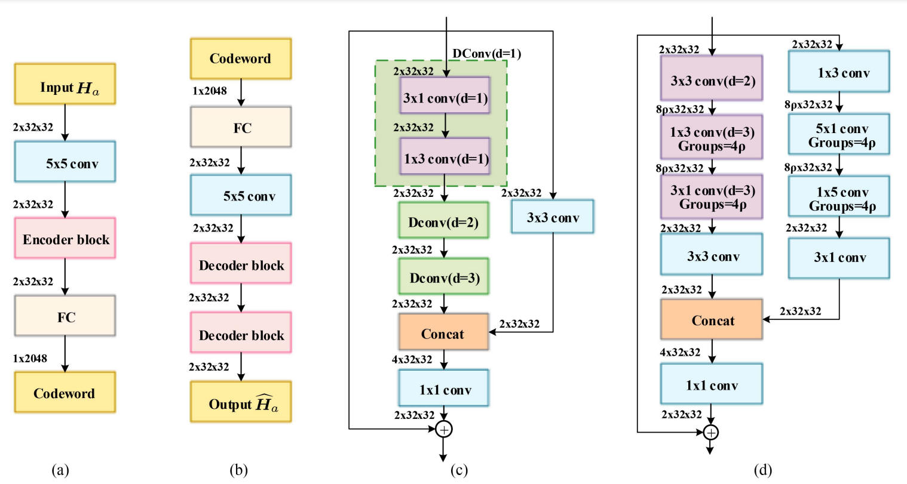
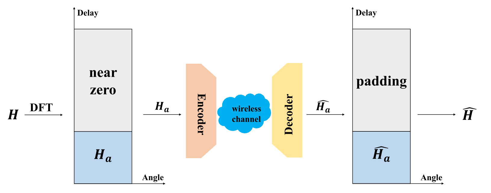

# Dilated Convolution Based CSI Feedback Compression for Massive MIMO Systems

Massive MIMO systems play a crucial role in next-generation wireless communications, but the significant overhead required to feed back the CSI matrices to the base station remains a challenge. In this report, I present the reproduction and validation of a novel dilated convolution-based CSI feedback network called DCRNet, which aims to compress CSI feedback efficiently while reducing computational complexity. Our experiments, conducted with the COST 2100 dataset, demonstrate similar NMSE to the original paper and confirm the effectiveness and efficiency of DCRNet in compressing CSI feedback in massive MIMO systems. This project highlights DCRNet's potential as a promising solution for addressing CSI feedback compression challenges in next-generation wireless communication systems.





## Requirements

To set up the environment:

```bash
conda env create -f "environment.yml"
conda activate dcrnet
```

## Dataset

Download the dataset from the following link and place it in the dataset directory. Make sure its under a directory named `COST2100`.

[Download Dataset]{https://www.dropbox.com/sh/edla5dodnn2ocwi/AADtPCCALXPOsOwYi_rjv3bda?dl=0}

## Training

To train the model, run the following command:

```bash
python main.py gpu=0 save=True val_interval=5 lr=0.005 db=cost2100_out reduction=4 expansion=1 epochs=2500
```

Available configurations are in the `config` directory.

## Evaluation

Find the checkpoints you want in the checkpoints directory (match the version number based on the logged configs in the outputs directory) and run the following command for evaluation:

```bash
python main.py gpu=0 save=True evaluate=True reduction=4 expansion=1 +test_model_name=[version]-best_model.pth
```

## Reference

Dilated Convolution Based CSI Feedback Compression for Massive MIMO Systems

GitHub: https://github.com/recusant7/DCRNet

```graphql
@ARTICLE{9797871,
  author={Tang, Shunpu and Xia, Junjuan and Fan, Lisheng and Lei, Xianfu and Xu, Wei and Nallanathan, Arumugam},
  journal={IEEE Transactions on Vehicular Technology}, 
  title={Dilated Convolution Based CSI Feedback Compression for Massive MIMO Systems}, 
  year={2022},
  volume={71},
  number={10},
  pages={11216-11221},
  doi={10.1109/TVT.2022.3183596}}
```


